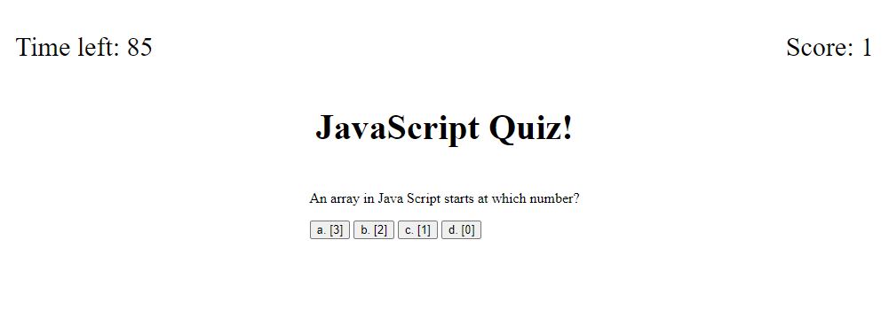

# Timed Quiz

## Description
This aplicaion is a timed quiz to test a users knowledge of javaScript. When a user starts the quiz they will be presented with questions to answer. The user will reveive a score when they have completed the quiz.

## Installation

N/A

##Usage

When the user loads the webpage, they will see a short description of the quiz and a start quiz button. When the button is clicked, the user will have 90 seconds to answer a series of quesitons. When a user answers correctly, their score will increase by 1. If a user chooses an incorrect answer, the timer will decrease by 15 seconds. When the quiz is over, the user will be prompted to add their initals. Once the user submits their initals, they will see a lits of the intials and scores of local attempts.

## Credits
Collaborated with: Sergei Malyshka

## Liscense
Please refer to the license in the repo